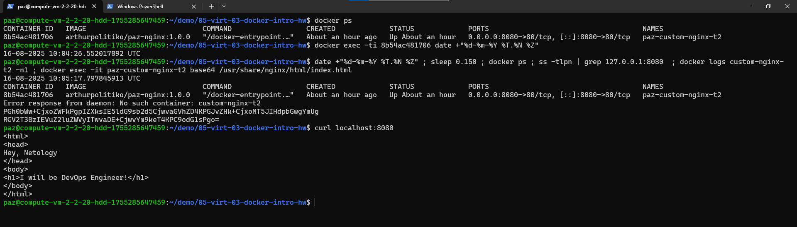
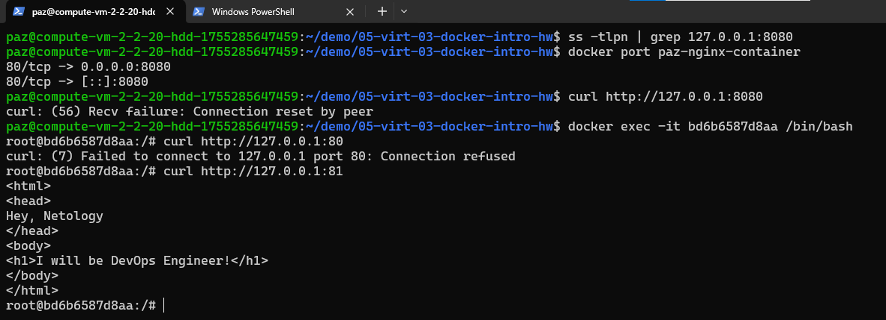
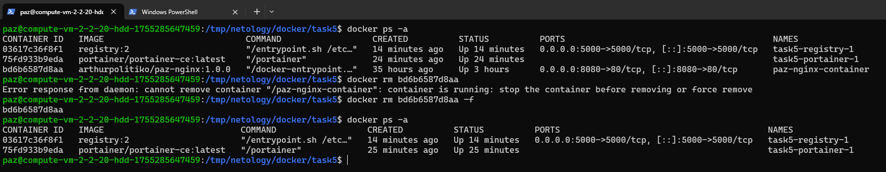
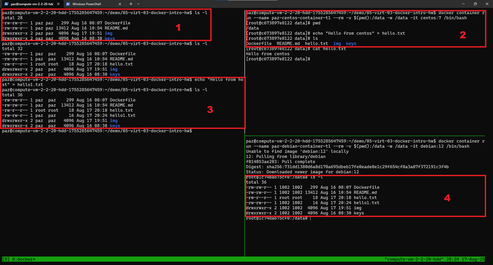
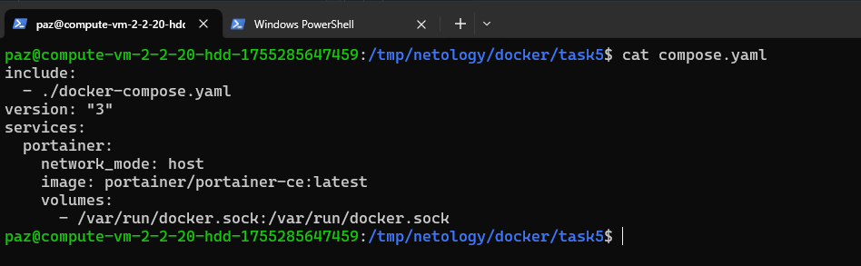
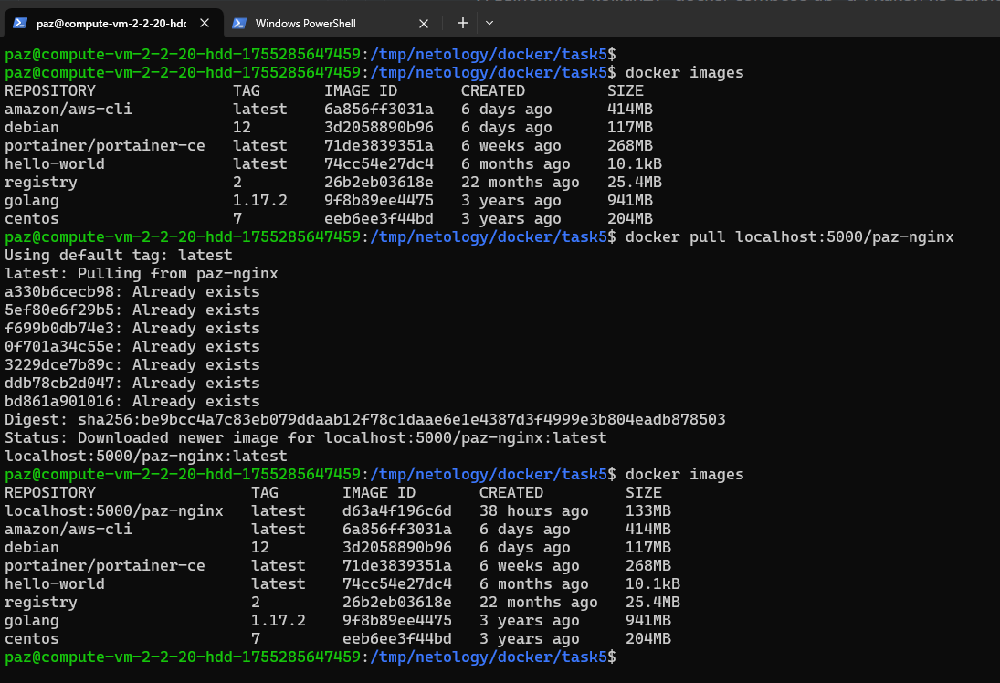
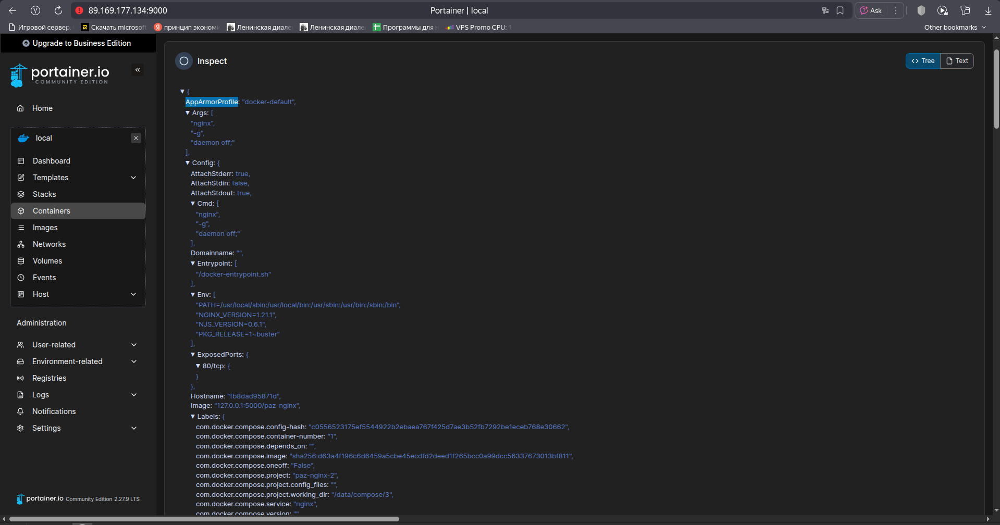
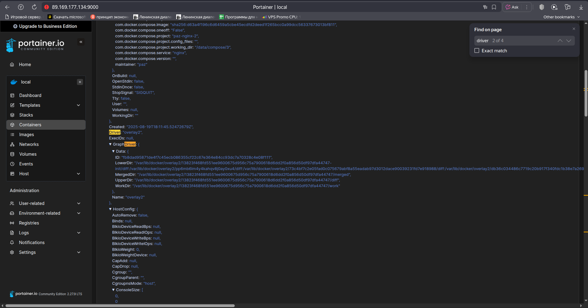

# Домашнее задание к занятию 4 «Оркестрация группой Docker контейнеров на примере Docker Compose»

## Задача 1

Сценарий выполнения задачи:
- Установите docker и docker compose plugin на свою linux рабочую станцию или ВМ.
- Если dockerhub недоступен создайте файл /etc/docker/daemon.json с содержимым: ```{"registry-mirrors": ["https://mirror.gcr.io", "https://daocloud.io", "https://c.163.com/", "https://registry.docker-cn.com"]}```
- Зарегистрируйтесь и создайте публичный репозиторий  с именем "custom-nginx" на https://hub.docker.com (ТОЛЬКО ЕСЛИ У ВАС ЕСТЬ ДОСТУП);
- скачайте образ nginx:1.21.1;
- Создайте Dockerfile и реализуйте в нем замену дефолтной индекс-страницы(/usr/share/nginx/html/index.html);
- Соберите и отправьте созданный образ в свой dockerhub-репозитории c tag 1.0.0 (ТОЛЬКО ЕСЛИ ЕСТЬ ДОСТУП). 
- Предоставьте ответ в виде ссылки на https://hub.docker.com/<username_repo>/custom-nginx/general .

Решение.
1. Установка тривиальна и её можно сделать по инструкции с официального сайта используя vpn
2. Регистрация аналогична. После регистрации создавать отдельно репозиторий не обязательно, он создстся сам когда мы сделаем push нашего image. После успешной регистрации создай токен (settings->Personal access tokens). Обязательно сохрани его в каком-либе безопасном мете. Посмотреть его снова не получится.
3. Образ nginx можно отдельно не качать, он подтянется автоматически после "сборки" Dockerfile
4. Сам Dockerfile содержит только 1 команду, это запись своих данных вместо дефолтной индекс-страницы. Её адрес можно увидеть в конфиге nginx (/etc/nginx/conf.d/default.conf)
5. Сборка выглядит так:
```
docker build -t arthurpolitiko/paz-nginx:1.0.0 -f Dockerfile .
```
-t Указываем ТЭГ для нашего образа
-f Докер файл 
.  Контекст сборки, то есть по этому пути docker будет искать всякие файлы прописанные в COPY или ADD

Перед отправкой в репозиторий необходимо зарегистрироваться на https://hub.docker.com/
В моём случае это выглядело так:
```
docker login -u arthurpolitiko
```
После чего docker спросил пароль и я ввел полученный ранее токен.
Теперь можно запушить наш image
```
docker push arthurpolitiko/paz-nginx:1.0.0
```

Оценить результат можно через web интерфейс или через cli. Так мы ищем/смотрим доступные images по определенному REPOSITORY
```
docker search arthurpolitiko
```


## Задача 2

1. Запустите ваш образ custom-nginx:1.0.0 командой docker run в соответвии с требованиями:
- имя контейнера "ФИО-custom-nginx-t2"
- контейнер работает в фоне
- контейнер опубликован на порту хост системы 127.0.0.1:8080
2. Не удаляя, переименуйте контейнер в "custom-nginx-t2"
3. Выполните команду ```date +"%d-%m-%Y %T.%N %Z" ; sleep 0.150 ; docker ps ; ss -tlpn | grep 127.0.0.1:8080  ; docker logs custom-nginx-t2 -n1 ; docker exec -it custom-nginx-t2 base64 /usr/share/nginx/html/index.html```
4. Убедитесь с помощью curl или веб браузера, что индекс-страница доступна.

В качестве ответа приложите скриншоты консоли, где видно все введенные команды и их вывод.


Решение.
1. Запуск контейнера:
```
docker run -d -p 8080:80 --name paz-nginx-container arthurpolitiko/paz-nginx:1.0.0
```
Оцениваем результат ```docker ps```
Тут стоит отметить, что в нашем Dockerfile не указан явно порт ```EXPOSE 80``` но он есть в родительском образе, поэтому можно опустить.

2. Переименование контейнера. Даже в googl не ситои лезть. Вызываем docker --help и ищем по слову rename.
```
docker rename 8b54ac481706 paz-custom-nginx-t2
```
Снова оцениваем результат ```docker ps```
А вот так смотрим кто биндит наш порт ```sudo ss -tulpn```. Не забывай запускать из-под превилегированного пользователя иначе pid-ы не увидишь. Ну и по PID получаем чуть подробное описание CMD вот таким образом ``` ps -ef |grep 12415 ``` где 12415 это PID процесса который bounded к порту 8080



## Задача 3

1. Воспользуйтесь docker help или google, чтобы узнать как подключиться к стандартному потоку ввода/вывода/ошибок контейнера "custom-nginx-t2".
2. Подключитесь к контейнеру и нажмите комбинацию Ctrl-C.
3. Выполните ```docker ps -a``` и объясните своими словами почему контейнер остановился.
4. Перезапустите контейнер
5. Зайдите в интерактивный терминал контейнера "custom-nginx-t2" с оболочкой bash.
6. Установите любимый текстовый редактор(vim, nano итд) с помощью apt-get.
7. Отредактируйте файл "/etc/nginx/conf.d/default.conf", заменив порт "listen 80" на "listen 81".
8. Запомните(!) и выполните команду ```nginx -s reload```, а затем внутри контейнера ```curl http://127.0.0.1:80 ; curl http://127.0.0.1:81```.
9. Выйдите из контейнера, набрав в консоли  ```exit``` или Ctrl-D.
10. Проверьте вывод команд: ```ss -tlpn | grep 127.0.0.1:8080``` , ```docker port custom-nginx-t2```, ```curl http://127.0.0.1:8080```. Кратко объясните суть возникшей проблемы.
11. * Это дополнительное, необязательное задание. Попробуйте самостоятельно исправить конфигурацию контейнера, используя доступные источники в интернете. Не изменяйте конфигурацию nginx и не удаляйте контейнер. Останавливать контейнер можно. [пример источника](https://www.baeldung.com/linux/assign-port-docker-container)
12. Удалите запущенный контейнер "custom-nginx-t2", не останавливая его.(воспользуйтесь --help или google)

В качестве ответа приложите скриншоты консоли, где видно все введенные команды и их вывод.


Решение.
Подключаемся к stdio контейнера 
```
docker container attach paz-custom-nginx-t2
```

После нажатмя Ctrl-C мы увидим примерно такое:
```
^C2025/08/16 10:11:00 [notice] 1#1: signal 2 (SIGINT) received, exiting
2025/08/16 10:11:00 [notice] 32#32: exiting
2025/08/16 10:11:00 [notice] 32#32: exit
2025/08/16 10:11:00 [notice] 33#33: exiting
2025/08/16 10:11:00 [notice] 33#33: exit
2025/08/16 10:11:00 [notice] 1#1: signal 17 (SIGCHLD) received from 33
2025/08/16 10:11:00 [notice] 1#1: worker process 32 exited with code 0
2025/08/16 10:11:00 [notice] 1#1: worker process 33 exited with code 0
2025/08/16 10:11:00 [notice] 1#1: exit
```
Видим что останавливается какой-то процесс. Если вызвать ```docker ps -a``` то увидим что наш контейнер завершил свою работу. Связано это с тем, что мы убили основной процесс PID 1 нашего контейнера *nginx*, после чего контейнер завершил свою работу. *docker attach* цепляется к основному процессу


Подключаемся к контейнеру с оболочкой bash
``` docker exec -it bd6b6587d8aa /bin/bash ```
Меняем конфигурацию nginx (порт ставим 81) и перезапускаем сервис.
Отключаемся от контейнера. Смотрим вывод команд ``` ss -tlpn | grep 127.0.0.1:8080 ``` , ``` docker port custom-nginx-t2 ```, ``` curl http://127.0.0.1:8080 ```

Получаем очивидную ошибку, отсутствия доступа к web серверу развернутому внутри контейнера который теперь сидит на 81 порту. Проблема в том, что Docker пробрасывает порт 8080 хоста на порт 80 контейнера, но NGINX внутри контейнера теперь слушает 81..


Сеть в контенерах реализована через стандартную магию линукса по изолированию групп процессов друг от друга и называется это всё namespace (man 7 namespaces). 
Фактически 
По умолчанию Docker создаёт мост docker0 с адресом 172.17.0.1/16. К нему подключаются все veth-интерфейсы контейнеров, что обеспечивает связь между контейнерами на уровне MAC-адресов (L2).
У нашего контейнера адрес 172.17.0.2. Можно узнать или из самого контейнера или вот такой хитрой командой:
``` docker inspect -f '{{range.NetworkSettings.Networks}}{{.IPAddress}}{{end}}' custom-nginx-t2 ```
Ну и далее прописываем наше DNAT правило в IPTABLES. 




## Задача 4

- Запустите первый контейнер из образа ***centos*** c любым тегом в фоновом режиме, подключив папку  текущий рабочий каталог ```$(pwd)``` на хостовой машине в ```/data``` контейнера, используя ключ -v.
- Запустите второй контейнер из образа ***debian*** в фоновом режиме, подключив текущий рабочий каталог ```$(pwd)``` в ```/data``` контейнера. 
- Подключитесь к первому контейнеру с помощью ```docker exec``` и создайте текстовый файл любого содержания в ```/data```.
- Добавьте ещё один файл в текущий каталог ```$(pwd)``` на хостовой машине.
- Подключитесь во второй контейнер и отобразите листинг и содержание файлов в ```/data``` контейнера.


В качестве ответа приложите скриншоты консоли, где видно все введенные команды и их вывод.


Решение



## Задача 5

1. Создайте отдельную директорию(например /tmp/netology/docker/task5) и 2 файла внутри него.
"compose.yaml" с содержимым:
```
version: "3"
services:
  portainer:
    network_mode: host
    image: portainer/portainer-ce:latest
    volumes:
      - /var/run/docker.sock:/var/run/docker.sock
```
"docker-compose.yaml" с содержимым:
```
version: "3"
services:
  registry:
    image: registry:2

    ports:
    - "5000:5000"
```

И выполните команду "docker compose up -d". Какой из файлов был запущен и почему? (подсказка: https://docs.docker.com/compose/compose-application-model/#the-compose-file )

2. Отредактируйте файл compose.yaml так, чтобы были запущенны оба файла. (подсказка: https://docs.docker.com/compose/compose-file/14-include/)

3. Выполните в консоли вашей хостовой ОС необходимые команды чтобы залить образ custom-nginx как custom-nginx:latest в запущенное вами, локальное registry. Дополнительная документация: https://distribution.github.io/distribution/about/deploying/
4. Откройте страницу "https://127.0.0.1:9000" и произведите начальную настройку portainer.(логин и пароль адмнистратора)
5. Откройте страницу "http://127.0.0.1:9000/#!/home", выберите ваше local  окружение. Перейдите на вкладку "stacks" и в "web editor" задеплойте следующий компоуз:

```
version: '3'

services:
  nginx:
    image: 127.0.0.1:5000/custom-nginx
    ports:
      - "9090:80"
```
6. Перейдите на страницу "http://127.0.0.1:9000/#!/2/docker/containers", выберите контейнер с nginx и нажмите на кнопку "inspect". В представлении <> Tree разверните поле "Config" и сделайте скриншот от поля "AppArmorProfile" до "Driver".

7. Удалите любой из манифестов компоуза(например compose.yaml).  Выполните команду "docker compose up -d". Прочитайте warning, объясните суть предупреждения и выполните предложенное действие. Погасите compose-проект ОДНОЙ(обязательно!!) командой.

В качестве ответа приложите скриншоты консоли, где видно все введенные команды и их вывод, файл compose.yaml , скриншот portainer c задеплоенным компоузом.


Решение.

1. В первых строчках ответ:
>The default path for a Compose file is compose.yaml (preferred) or compose.yml that is placed in the working directory. Compose also supports docker-compose.yaml and docker-compose.yml for backwards compatibility of earlier versions. If both files exist, Compose prefers the canonical compose.yaml.

2. Из документации узнаём, что существует два пути. Или создать общий файл в котором перечислить какие yaml нужно обрабатывать, или с помощью нехитрой инструкции include подключаем another file.
```
include:
  - docker-compose.yaml
services:
  portainer:
    network_mode: host
    image: portainer/portainer-ce:latest
    volumes:
      - /var/run/docker.sock:/var/run/docker.sock
```



3. В принципе дока оказалась полезной, но похожее мы делали ранее когда закидывали наш образ в репозиторий docker hub. 

Логика примерно такая. Делаем pull образа, меняем его, запекаем, меняем тэг, пушим в наш репозиторий



4. Не знаю почему, но portainer в моём случае что-то уж больно капризным оказался. Я его пытался использовать в ВМ из облака и как-то не сразу получилось настроить обратный прокси. На всякий случай вот изменения nginx:

```
server {
	server_name 89.169.188.213; 

	location / {
        	proxy_pass http://localhost:9000/;
	        proxy_http_version 1.1;
        	proxy_set_header Host $host;
	        proxy_set_header X-Real-IP $remote_addr;
        	proxy_set_header X-Forwarded-For $proxy_add_x_forwarded_for;
	        proxy_set_header X-Forwarded-Proto $scheme;
        	proxy_set_header Upgrade $http_upgrade;
	        proxy_set_header Connection "upgrade";
        
	        proxy_redirect ~^http://localhost:9000/(.*)$ /$1;
	}
}

```

Работает так-же на 9000 порту.

5. Можно из cli а можно и из web моррды. Странно что из бота Telegramm нельзя делать...

6. 



7. Мы получаем сообщение 
> WARN[0000] Found orphan containers 

То есть найден осиротевший (orphan) контейнер и compose не знает что с ним делать и нам предлагают снести его дописав команду ```--remove-orphans```. 

Интересно, а как docker вообще определяет что какой-то контейнер был поднят именно этим или каким-то иным docker compose и не снесёт ли он за-компанию он какой-то другой контейнер?
Оказывается всё простьо. Вот тут https://docs.docker.com/reference/cli/docker/inspect/ нам советуют испоьлзовать вот такую команду ``` docker inspect --format='{{json .Config}}' $INSTANCE_ID  ```
в результате ищем строчку **com.docker.compose.project** она содержит название проекта. В общем, именно по этой плашке docker compose и понимает что контейнеры это части одного проекта.
А вот так можно найти контейнеры одного проекта ```docker ps -a --filter "label=com.docker.compose.project=task5" ```

Гасим проект:
```docker compose stop```


---
